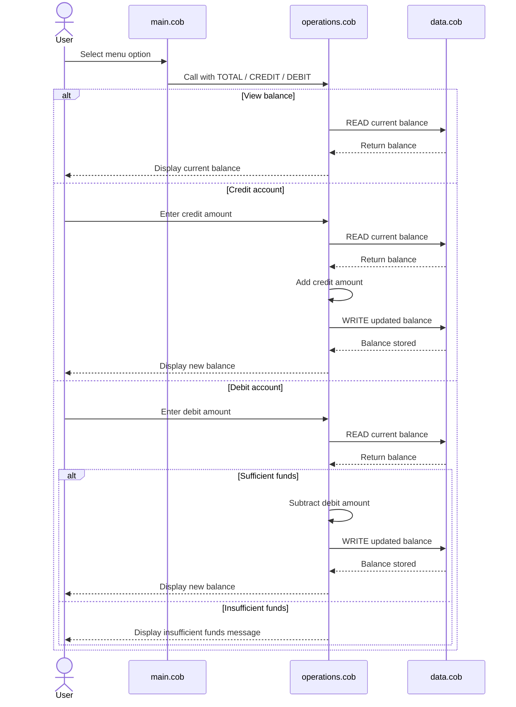

# COBOL Account Management Overview

This directory documents the legacy COBOL sample that implements a simple student account management flow. The application is split into three programs, each with a focused responsibility:

## File Responsibilities

### `src/cobol/main.cob`
This is the interactive entry point. It shows the menu, accepts the user's choice, and routes control to the operations program.

Main responsibilities:
- Display the account management menu.
- Accept a choice from 1 to 4.
- Call the operations program for balance checks, credits, and debits.
- Exit the loop when the user selects Exit.

### `src/cobol/operations.cob`
This program contains the business logic for account actions.

Main responsibilities:
- Handle balance inquiries.
- Prompt for and apply credit amounts.
- Prompt for and apply debit amounts.
- Enforce the insufficient-funds check before a debit is completed.
- Call the data program to read and write the current balance.

### `src/cobol/data.cob`
This program acts as the storage layer for the account balance.

Main responsibilities:
- Return the current balance when asked to read.
- Persist an updated balance when asked to write.
- Keep the balance in working storage for the lifetime of the program execution.

## Key Functions

The current implementation is organized around three key actions:

- View balance: reads the current balance and displays it.
- Credit account: adds a user-entered amount to the balance and stores the result.
- Debit account: subtracts a user-entered amount only if enough funds are available.

## Student Account Business Rules

The code models a single student account with these rules:

- The starting balance is `1000.00`.
- Credits increase the balance by the entered amount.
- Debits decrease the balance only when the balance is greater than or equal to the requested amount.
- If the balance is too low, the debit is rejected and the balance is left unchanged.
- The account data is held in working storage, so it is not durable across separate program runs.
- The menu accepts only choices `1` through `4`.

## Notes

- Amounts are handled as fixed-point numeric values with two decimal places.
- The current implementation does not include validation for negative values or malformed input.

## Sequence Diagram

